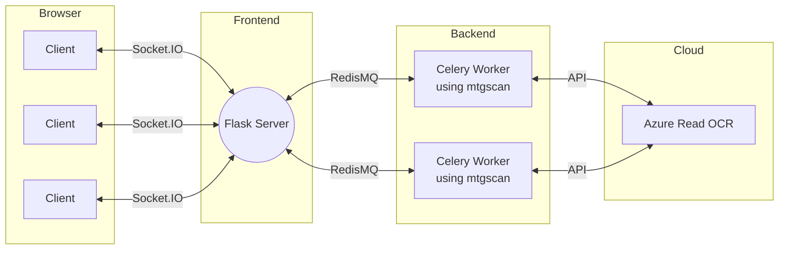

# MTGScan app



This is a web application for [mtgscan](https://github.com/fortierq/mtgscan), to recognize Magic cards on an image. Try it: https://mtgscan.azurewebsites.net (I use Azure free tier - it may takes few seconds to start).

# Requirements

- docker-compose
- Azure Computer Vision credentials

I am using Azure free tier, which comes with some [limitations](https://docs.microsoft.com/en-us/azure/cognitive-services/computer-vision/overview-ocr):
> - Supported file formats: JPEG, PNG, BMP, PDF, and TIFF
> - The file size of images must be less than 500 MB (4 MB for the free tier) and dimensions at least 50 x 50 pixels and at most 10000 x 10000 pixels.

# Usage

At the root of this project:
- Create a file redis/redis.conf containing `requirepass <password>`  
- Create a file redis/redis.env containing: `REDIS_PASSWORD=<password>`
- Create a file azure.env containing:
```
AZURE_VISION_KEY=...
AZURE_VISION_ENDPOINT=...
```
With your [Azure Computer Vision](https://azure.microsoft.com/fr-fr/services/cognitive-services/computer-vision) credentials  

Then:
- `make up`  
- Go to http://localhost:5000  
- Load an image or an URL containing magic cards to get the decklist

# RESTful API

This application also defines a RESTful API.

## Request

`GET /api/<url>`  
Get cards (JSON format) on the image given by url

<br>

Example:
```
curl -G 127.0.0.1:5000/api/https://user-images.githubusercontent.com/49362475/105632710-fa07a180-5e54-11eb-91bb-c4710ef8168f.jpeg
```

```
{
  "maindeck": {
    "Ancient Tomb": 4, 
    "Arcbound Ravager": 4, 
    "Black Lotus": 1, 
    "Chalice of the Void": 1, 
    "Chief of the Foundry": 3, 
    "Fleetwheel Cruiser": 2, 
    "Foundry Inspector": 4, 
    "Lodestone Golem": 1, 
    "Mana Crypt": 1, 
    "Mishra's Factory": 4, 
    "Mishra's Workshop": 4, 
    "Mox Emerald": 1, 
    "Mox Jet": 1, 
    "Mox Pearl": 1, 
    "Mox Ruby": 1, 
    "Mox Sapphire": 1, 
    "Mystic Forge": 1, 
    "Phyrexian Revoker": 4, 
    "Sacrifice": 1, 
    "Sol Ring": 1, 
    "Sphere of Resistance": 4, 
    "Stonecoil Serpent": 3, 
    "Strip Mine": 1, 
    "Thorn of Amethyst": 1, 
    "Tolarian Academy": 1, 
    "Traxos, Scourge of Kroog": 1, 
    "Trinisphere": 1, 
    "Walking Ballista": 5, 
    "Wasteland": 4
  }, 
  "sideboard": {
    "Crucible of Worlds": 2, 
    "Leyline of the Void": 4, 
    "Mindbreak Trap": 3, 
    "Pithing Needle": 4, 
    "Wurmcoil Engine": 2
  }
}
```
